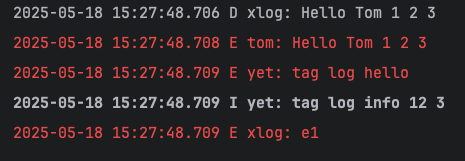

## dart log

### example

```dart

void main() async {
  println("this", "is", "log");
  println("this", "is", "log", sep:", ");
  StringBuffer buf = StringBuffer();
  println("this", "is", "log", buf: buf, sep:", ");
  print(buf.toString());
  
  _normal();
  _tagLog();
  _filterLog();
}

void _normal() {
  logd("Hello", "Tom", 1, 2, 3);
  loge("Hello", "Tom", 1, 2, 3, tag: "tom");
}

void _tagLog() {
  var lg = TagLog("yet");
  lg.e("tag log hello");
  lg.i("tag log info", 12, 3);
}

void _fileLog() {
  var p = FileLogPrinter(File("/Users/entao/Downloads/a.txt"));
  var c = ConsolePrinter.inst;
  c.level = LogLevel.warning;
  var tree = TreeLogPrinter([p, c]);
  XLog.setPrinter(tree);

  logd("to file");
}

void _filterLog() {
  XLog.filter = FuncLogFilter((e) => e.level >= LogLevel.error);
  loge("e1");
  logd("d1");
}

```


