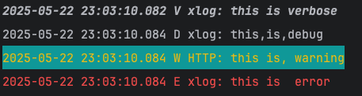

## dart log

### Example

```dart

void main() async {
  normal();
  tagLog();
  filterLog();
}

void normal() {
  logd("Hello", "Tom", 1, 2, 3);
  loge("Hello", "Tom", 1, 2, 3, tag: "tom");
}

void tagLog() {
  var lg = TagLog("yet");
  lg.e("tag log hello");
  lg.i("tag log info", 12, 3);
}

void fileLog() {
  var p = FileLogPrinter(File("/Users/entao/Downloads/a.txt"));
  var c = ConsolePrinter.inst;
  c.level = LogLevel.warning;
  var tree = TreeLogPrinter([p, c]);
  XLog.setPrinter(tree);

  logd("to file");
}

void filterLog() {
  XLog.filter = FuncLogFilter((e) => e.level >= LogLevel.error);
  loge("e1");
  logd("d1");
}

```

### Console log with color

```dart
ConsolePrinter.setEscapeCodes(LogLevel.warning, [EscapeCode.yellowLight, EscapeCode.backCyan]);
logv("this", "is", "verbose");
logd("this", "is", "debug", sep: ",");
logw("this is", "warning", tag: "HTTP", sep: ", ");
loge("this is", " error");
```


